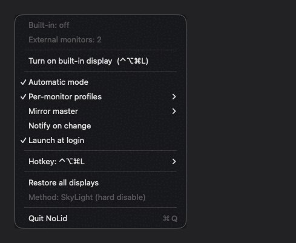

<h1 align="center">NoLid</h1>

<p align="center">
  Apaga la pantalla integrada de tu MacBook <strong>con la tapa abierta</strong>,<br>
  para que macOS use sólo tus monitores externos.
</p>

<p align="center">
  
  
  
  
  
</p>

<p align="center">
  <a href="README.md">English</a> · <strong>Español</strong>
</p>

<p align="center">
  
</p>

---

## El problema

Conectas dos monitores externos y macOS insiste en tratar la pantalla del
MacBook como un tercer escritorio. El cursor se te escapa hacia abajo, las
ventanas aparecen donde no las quieres y la única solución oficial es cerrar la
tapa — perdiendo el teclado, el trackpad, el Touch ID y la refrigeración.

La solución conocida es **BetterDisplay Pro**, que cuesta $21.99 por una función
que son unas cuantas llamadas a CoreGraphics.

Esto es esa función. Nada más.

|   | NoLid | BetterDisplay Pro |
|---|---|---|
| Apagar la integrada con la tapa abierta | ✅ | ✅ |
| Precio | Gratis (MIT) | $21.99 |
| Escala de resolución, HiDPI, PIP, XDR... | ❌ | ✅ |
| Tamaño | 2.6k líneas, 0 dependencias | Aplicación completa |
| Telemetría / cuenta / licencia | ❌ | Licencia |

Si quieres el resto de lo que hace BetterDisplay, cómpralo: es buen software.
Si sólo querías apagar la pantalla de abajo, ya está aquí.

## Dos cosas que no hace nadie más

Hay otras herramientas de código abierto en este nicho, y algunas son buenas.
Dos cosas de aquí no están en ninguna.

**1. NoLid comprueba que la pantalla se apagó de verdad.**

El símbolo privado del que dependen todas puede devolver éxito y no apagar
nada. Casi todas se fían del código de retorno. NoLid verifica contra
`CGGetActiveDisplayList`, deshace el intento fallido y cae al respaldo público
de mirroring automáticamente. Esa es la diferencia entre "funciona en mi Mac" y
"funciona en el tuyo".

`nolid doctor` lo demuestra en tu máquina con un comando: hace la desconexión
real, comprueba si el panel desapareció y lo restaura de inmediato.

**2. La recuperación funciona con la app muerta.**

Un watchdog dentro de la app no te salva de que la app crashee. `nolid panic` y
`nolid on` hablan directo con CoreGraphics cuando la app no contesta — sin una
segunda app que abrir, sin Spotlight, y funciona **por SSH desde otra máquina**
con tu pantalla en negro.

Los comandos que *apagan* pantallas se niegan a correr sin la app a propósito:
apagar sin las redes de seguridad no tiene forma de deshacerse solo.

## Qué hace

- **Toggle** de la pantalla integrada desde la barra de menús, con un atajo
  global o desde la terminal.
- **Atajo configurable.** `⌃⌥⌘L` por defecto, cambiable desde el menú.
- **Modo automático**: la apaga sola al conectar monitores externos y la
  reactiva al desconectarlos.
- **Perfiles por combinación de monitores**: recuerda qué querías en casa y qué
  querías en la oficina, y lo aplica al reconocer los monitores.
- **Elección del monitor del espejo** cuando se usa el respaldo de mirroring.
- **CLI**: `nolid on|off|toggle|panic|status|doctor`, con salida JSON.
- **Atajos y automatizaciones de Modo Concentración** vía App Intents, más un
  esquema de URL `nolid://` para Raycast, Alfred y Keyboard Maestro.
- **Aviso opcional** cada vez que la integrada cambia de estado. Apagado por defecto.
- **Recuperación de emergencia**: si te quedaras sin ninguna pantalla activa, la
  vuelve a encender sola. Hay tres redes independientes (ver
  [Redes de seguridad](#redes-de-seguridad)).
- **Avisos que no bloquean.** Ningún diálogo modal puede dejarte la app colgada
  mientras peleas con las pantallas.
- **Arranque al iniciar sesión**, opcional, vía `SMAppService`.
- Corre como agente (`LSUIElement`): sin icono en el Dock, sin ventanas.

El menú entero:

```
  Built-in: active
  External monitors: 2
  ─────────────────────────────────
  Turn off built-in display  (⌃⌥⌘L)
  ─────────────────────────────────
  ✓ Automatic mode
    Per-monitor profiles           ▸
    Mirror master                  ▸
    Notify on change
    Launch at login
  ─────────────────────────────────
    Hotkey: ⌃⌥⌘L                   ▸
  ─────────────────────────────────
  Restore all displays
  Method: SkyLight (hard disable)
  ─────────────────────────────────
  Quit NoLid                      ⌘Q
```

## Requisitos

- macOS 13 (Ventura) o superior.
- Las **Command Line Tools** de Xcode. Son gratis y no hace falta Xcode entero:
  `xcode-select --install`.
- **Al menos un monitor externo conectado.** NoLid se niega a apagar la
  integrada si es la única pantalla que tienes. No es un bug: es la primera red
  de seguridad.

Compila y funciona en Apple Silicon y en Intel. `build.sh` detecta la
arquitectura con `uname -m`.

Las acciones de Atajos necesitan algo más: `appintentsmetadataprocessor`, que
viene con Xcode completo y no con las Command Line Tools solas. `build.sh` lo
detecta y te lo dice. Sin él todo lo demás compila y funciona igual — sólo
faltan las acciones de Atajos.

## Instalación

```bash
git clone https://github.com/NicolasMarino/nolid.git && cd nolid
./build.sh
cp -R build/NoLid.app /Applications/
open /Applications/NoLid.app
```

Aparece un icono de portátil en la barra de menús.

La app va firmada **ad-hoc**, no con una cuenta de desarrollador de pago. La
primera vez macOS puede pedirte confirmarla en **Ajustes del Sistema →
Privacidad y seguridad → Abrir de todos modos**.

> **El icono no aparece?** Casi siempre está detrás de la muesca. Ver
> [Solución de problemas](#solución-de-problemas).

La CLI es opcional y va aparte:

```bash
sudo cp build/nolid /usr/local/bin/
nolid status
```

Para que la app arranque sola: menú de NoLid → **Abrir al iniciar sesión**. Con
firma ad-hoc el hash del binario cambia en cada compilación, así que hay que
volver a activarlo después de cada `./build.sh`.

## Uso

### Perfiles por monitor

Sin perfiles hay una única preferencia global, y el modo automático lo decide
todo por el mero hecho de que haya externos o no. Eso no distingue entre "en
casa, con dos monitores, la integrada estorba" y "en la oficina, con uno solo,
la integrada me sirve de secundaria".

Actívalos en **Per-monitor profiles → Enable profiles**. A partir de ahí, cada
vez que enciendes o apagas la integrada, NoLid guarda esa decisión asociada al
conjunto de monitores que tienes conectados en ese momento. Al reconocer esos
mismos monitores, la reaplica.

Los monitores se identifican por su UUID (`CGDisplayCreateUUIDFromDisplayID`),
no por su `CGDirectDisplayID`, que se reasigna en cada reconexión. El orden en
que los enchufas no importa: la clave del perfil va ordenada.

Prioridad, de más a menos fuerte:

1. Perfil guardado para esta combinación de monitores.
2. Modo automático.
3. La última preferencia global.

### Monitor del espejo

Sólo importa cuando está activo el respaldo de mirroring. Por defecto NoLid usa
el primer externo que devuelve el sistema, y ese orden no es estable. Si tienes
dos monitores y quieres decidir cuál hace de maestro, el submenú **Mirror
master** aparece en cuanto hay más de uno.

La elección se guarda por UUID. Si desconectas ese monitor, NoLid cae al primero
disponible sin quejarse.

### Atajo

`⌃⌥⌘L` por defecto. **Hotkey → Change hotkey…** abre un panel que se queda con la
siguiente combinación que pulses. Necesita al menos uno de `⌃`, `⌥` o `⌘`: sin
modificador estarías secuestrando una tecla normal en todo el sistema.

Si la combinación elegida ya está ocupada por otra app, NoLid te avisa y
restaura la anterior — no te deja sin atajo.

### CLI

```
$ nolid status
Built-in:        off
External:        2 (LG UltraFine, DELL U2720Q)
Method:          SkyLight (hard disable)
Automatic mode:  yes
Profiles:        yes
Topology:        DELL U2720Q + LG UltraFine
```

| Comando | Efecto | Funciona sin la app o si falla |
|---|---|---|
| `nolid on` | Enciende la pantalla integrada | ✅ directo |
| `nolid off` | La apaga (necesita un monitor externo) | ❌ |
| `nolid toggle` | Alterna | ❌ |
| `nolid panic` | Reactiva todas las pantallas | ✅ directo |
| `nolid status` | Estado actual, legible | ❌ |
| `nolid doctor` | Qué soporta este Mac de verdad | ✅ directo |

Opciones: `--json` para salida legible por máquina (`status` y `doctor`),
`--no-probe` para que `doctor` omita la prueba en vivo.

Códigos de salida: `0` correcto, `1` la app no responde, `2` uso incorrecto,
`3` el comando no surtió efecto — típicamente `nolid off` sin monitores
externos — y `4` una pantalla quedó inutilizable y no se pudo recuperar.
Todos los comandos verifican el resultado consultando el estado después de
enviarlo: un script puede distinguir "hecho" de "ignorado".

`3` y `4` están separados a propósito. `3` es una operación sin efecto y sin
consecuencias: no pasó nada y no hay nada roto. `4` significa que ahora mismo
hay algo mal en pantalla: `nolid doctor` lo devuelve cuando su prueba en vivo
apagó la integrada y no logró recuperarla, y `nolid panic` y `nolid on` lo
devuelven cuando la recuperación falló de verdad. Un script puede condicionar
sólo sobre `4` para avisar a una persona.

La CLI **no toca las pantallas**. Le pide a la app que corre en la barra de
menús que lo haga, por `DistributedNotificationCenter`. Así hay un único proceso
dueño del estado y las redes de seguridad viven en un solo sitio. Si la app no
está abierta, la CLI falla con código 1 en vez de dejar el sistema a medias.

Ejemplo con `jq`:

```bash
nolid status --json | jq -r '.method'   # skylight | mirroring
```

### Qué puede y qué no puede hacer el canal de control

`DistributedNotificationCenter` es un bus por usuario, visible en todo el
sistema. Cualquier proceso que corra con el mismo usuario puede publicar
`dev.nolid.command.off` y apagar la pantalla integrada, exactamente igual que la
CLI. Lo mismo vale para el esquema `nolid://`, que una página web puede disparar
una vez aceptado el aviso de "abrir en NoLid?" que aparece la primera vez.

Es el compromiso deliberado por no necesitar **ningún permiso, ningún puerto
abierto y ningún servicio XPC**. Lo peor que puede hacer un proceso local hostil
es alternar una pantalla — lo mismo que puedes hacer tú desde el menú — y todas
las redes de seguridad siguen aplicando: el watchdog, el callback de
reconfiguración y `nolid panic` siguen devolviendo la imagen. El canal no cruza
cuentas de usuario.

Las respuestas van dirigidas, no se emiten a todo el bus. Cada invocación de
`nolid` genera un token aleatorio, lo envía junto con el comando y escucha en un
canal derivado de él. Dos procesos `nolid` simultáneos no pueden leer la
respuesta del otro, y un proceso que nunca vio el token no puede depositar una
respuesta falsa en el canal de quien preguntó.

Esto no es una frontera de seguridad y no se presenta como tal. Un proceso que
corra con el mismo usuario puede observar el comando, leer el token y ganarle la
carrera a la respuesta real. macOS no traza ninguna línea entre procesos del
mismo usuario — otro proceso podría igualmente adjuntar un depurador o
reemplazar el binario — así que ningún esquema de tokens cierra eso. No conviene
programar una decisión sensible para la privacidad, como iniciar una grabación o
compartir la pantalla, basándose sólo en la salida de `nolid status`.

`nolid status` además informa los nombres de los monitores y la topología, así
que trata su salida como cualquier otro detalle local del sistema.

### Atajos y automatizaciones

NoLid expone cuatro App Intents, así que sus acciones aparecen en la app Atajos
bajo **NoLid** sin configurar nada:

| Acción | Efecto |
|---|---|
| Toggle Built-in Display | Alterna el estado actual |
| Turn Off Built-in Display | Falla con un error real si no hay externo conectado |
| Turn On Built-in Display | Devuelve el panel |
| Restore All Displays | El botón de pánico |

Corren dentro del proceso de la app, así que pasan por el mismo
`DisplayManager` que el menú y heredan todas las redes de seguridad. Si la app
no está corriendo, el sistema la lanza — es un agente, no aparece nada en
pantalla.

Lo que importa son las automatizaciones de Modo Concentración: *cuando se activa
Modo Trabajo, apagá la integrada.* Ningún competidor del nicho hace eso.

Para lo que hable URLs — Raycast, Alfred, Keyboard Maestro, Stream Deck — hay
esquema:

```
nolid://toggle    nolid://on    nolid://off    nolid://panic
```

Mismo enrutado que la CLI y los intents. Una URL nunca puede llegar a un camino
que se saltee las redes de seguridad.

### Notificaciones

**Notify on change** en el menú avisa cada vez que la integrada se apaga o
vuelve. Está apagado por defecto a propósito: el modo automático está pensado
para ser invisible, y un aviso en cada conexión y desconexión sería ruido.
Encendelo mientras aprendés qué hace el modo automático, y apagalo cuando le
tengas confianza.

Los fallos siempre avisan, independientemente de este ajuste.

## Cómo funciona

macOS no expone ninguna forma pública de desconectar una pantalla. Lo que sí
existe es un símbolo privado en `SkyLight.framework`:

```c
CGError SLSConfigureDisplayEnabled(CGDisplayConfigRef config,
                                   CGDirectDisplayID display,
                                   bool enabled);
```

Se llama dentro de una transacción `CGBeginDisplayConfiguration` /
`CGCompleteDisplayConfiguration`, igual que cualquier cambio de resolución. Es
la misma técnica que usan BetterDisplay y proyectos similares.

**No** requiere desactivar SIP ni entitlements especiales: el símbolo se
resuelve con `dlsym` en tiempo de ejecución. Si Apple lo quita en una versión
futura, `dlsym` no devuelve nada, NoLid pierde el método fuerte y cae al
respaldo de forma limpia: ese caso está contemplado. Si en cambio Apple conserva
el nombre y cambia la firma de la función, ninguna comprobación en tiempo de
ejecución puede detectarlo y el comportamiento queda indefinido. Es el límite
conocido de llamar a un símbolo privado sin versionar.

`CGCompleteDisplayConfiguration` se llama con `.forSession`, no con
`.permanently`. El cambio no se escribe en las preferencias del sistema y
desaparece al cerrar sesión. La persistencia la maneja la app, que es quien sabe
cómo deshacerla.

### Los dos métodos

|   | Fuerte | Respaldo |
|---|---|---|
| API | `SLSConfigureDisplayEnabled` (privada) | `CGConfigureDisplayMirrorOfDisplay` (pública) |
| Efecto | La pantalla desaparece del sistema | Refleja al externo, brillo a 0 |
| Escritorio independiente | Eliminado | Eliminado |
| Retroiluminación | Apagada | Encendida al mínimo |
| Disponibilidad | Depende de la versión de macOS | Siempre |

En algunas combinaciones de hardware y versión de macOS,
`SLSConfigureDisplayEnabled` **devuelve éxito y no apaga nada**. Por eso NoLid no
se fía del código de retorno: después de llamarlo comprueba si la pantalla
desapareció de verdad de `CGGetActiveDisplayList`. Si sigue ahí, deshace el
intento y cae al respaldo.

El respaldo no "desconecta" la pantalla, pero deja de ser un escritorio
independiente — que es la molestia real — y el cursor ya no se te escapa.

**El menú te dice cuál de los dos está activo**, y `nolid status` también. Esa
línea `Method:` te dice en diez segundos qué soporta tu Mac.

## Redes de seguridad

El fallo que importa en una app así es dejarte sin ninguna pantalla y sin forma
de recuperarla. Hay tres capas independientes:

1. **Precondición.** No permite apagar la integrada si no hay ningún monitor
   externo activo. El item del menú aparece deshabilitado y `nolid off` no hace
   nada.
2. **Callback de reconfiguración.** `CGDisplayRegisterReconfigurationCallback`
   dispara en cuanto cambia la topología. Si desconectas todos los externos, la
   integrada vuelve en ~1 s.
3. **Watchdog cada 8 s.** Corre en modo `.common`, así que sigue vivo con el
   menú abierto o con un panel en pantalla — justo cuando hace falta. Si detecta
   cero pantallas activas deja de ser quirúrgico: en vez de reintentar el único
   id de la integrada que cacheó antes de apagarla, reactiva todo lo que el
   sistema todavía lista. Un id que ya no nombra nada no vuelve a la vida a
   fuerza de reintentos, y una pantalla en negro es el peor lugar para ser
   preciso.

Además:

- `apply()` es idempotente y la ruta de encendido se ejecuta
  **incondicionalmente**: también restaura el brillo si macOS deshizo el espejo
  por su cuenta.
- **El camino de vuelta se verifica con el mismo rigor que el de ida.** Al
  encender la integrada se vuelve a leer la lista de pantallas activas en vez de
  dar por hecho que la llamada funcionó, y se avisa si el panel no volvió de
  verdad. Un fallo al restaurar se informa, no se pasa por alto.
- **Ningún aviso bloquea el run loop.** Los mensajes salen por
  `UNUserNotificationCenter` o, si no hay permiso, por un panel flotante que se
  cierra solo. Un `NSAlert` modal disparado desde el watchdog dejaría la app sin
  responder a nada — incluida la CLI — hasta que alguien pulsara OK.
- Al despertar del sleep se reaplica el estado tras 2 s.
- Al salir de la app se reactiva todo, conservando tu preferencia para el
  próximo arranque.
- **`nolid panic` y `nolid on` funcionan con la app muerta — y con la app viva
  fallando.** Las tres redes de arriba viven dentro del proceso; ésta no. La
  recuperación directa estaba reservada para una app que no contestaba, y eso
  dejaba afuera el caso peor: una app que contesta, lo intenta y no puede te
  deja exactamente en el mismo lugar, mirando nada. Ahora las dos fallas llegan
  al mismo camino de CoreGraphics. Y corre por SSH.
- **Botón de pánico**: "Restore all displays" en el menú, o
  `nolid panic` desde cualquier terminal. No toca el perfil guardado: es una
  salida de emergencia, no una decisión de preferencia.
- El estado es `.forSession`: cerrar sesión limpia cualquier cosa rara.

## Solución de problemas

<details>
<summary><strong>No veo el icono en la barra de menús</strong></summary>

<br>

Casi siempre está ahí, escondido detrás de la **muesca** del MacBook. macOS no
reordena los items cuando la barra se llena: simplemente los dibuja debajo del
notch, donde son invisibles.

Comprueba si el item existe de verdad:

```bash
osascript -e 'tell application "System Events" to tell process "NoLid" \
  to get properties of menu bar item 1 of menu bar 1'
```

Si responde con una `position` y `help: NoLid — ...`, el icono está cargado. Si
la coordenada X cae dentro de la muesca (en un MacBook de 14" a 1512 pt de
ancho, aproximadamente entre 670 y 842), ese es el problema.

Arréglalo con una de estas:

- Mantén **⌘** y arrastra el icono hacia la derecha para sacarlo de la muesca.
- Cierra alguna otra app de la barra de menús: NoLid se correrá solo.
- Usa un gestor de barra de menús ([Ice](https://github.com/jordanbaird/Ice) es
  gratis y de código abierto).

Mientras tanto la app funciona igual: `nolid toggle` desde la terminal no
depende del icono.

</details>

<details>
<summary><strong>"Apagar pantalla integrada" está en gris</strong></summary>

<br>

No tienes ningún monitor externo activo. Es la primera red de seguridad: NoLid
no te deja quedarte sin pantallas. Conecta el externo y el item se habilita solo.

Verifica lo que ve el sistema:

```bash
nolid status
system_profiler SPDisplaysDataType | grep -E "Display Type|Resolution"
```

</details>

<details>
<summary><strong>Me quedé sin imagen</strong></summary>

<br>

En orden, de menos a más drástico:

1. Si fue el **respaldo de mirroring**, la pantalla está encendida a brillo 0.
   Sube el brillo con **F2**.
2. Espera 8 segundos. El watchdog debería haberla reactivado ya.
3. Desde otra máquina por SSH, o a ciegas: `nolid panic`.
4. Cierra y abre la tapa, o desconecta y reconecta un monitor: cualquiera de las
   dos cosas dispara el callback de reconfiguración.
5. Cierra sesión con **⇧⌘Q**. El estado es `.forSession` y desaparece.
6. Reinicia. No queda nada escrito en las preferencias del sistema.

</details>

<details>
<summary><strong>El atajo no hace nada</strong></summary>

<br>

Otra app lo tiene registrado. El submenú **Hotkey** te lo dice con la línea
"Taken by another app".

Elige otro con **Hotkey → Change hotkey…**. Si la combinación nueva también está
ocupada, NoLid te avisa y deja la anterior.

</details>

<details>
<summary><strong>`nolid` dice que la app no responde</strong></summary>

<br>

La CLI habla con la app: si la app no está abierta, no hay con quién hablar.

```bash
open -a NoLid
nolid status
```

Si la app está abierta y aun así falla, el canal es
`DistributedNotificationCenter`, que no funciona entre usuarios distintos.
Ejecuta la CLI con el mismo usuario que tiene la sesión gráfica.

</details>

<details>
<summary><strong>Los perfiles no se aplican</strong></summary>

<br>

Comprueba que están activados y qué perfil corresponde a los monitores de ahora:

```bash
nolid status --json | jq '{profilesEnabled, topology}'
```

Un perfil se guarda la primera vez que enciendes o apagas la integrada **con
perfiles ya activados**. Activarlos no rellena nada retroactivamente: el submenú
mostrará "Sin recordar todavía" hasta que tomes una decisión.

</details>

<details>
<summary><strong>El arranque automático se desactiva solo</strong></summary>

<br>

Es consecuencia de la firma ad-hoc: el hash del binario cambia en cada
compilación y `SMAppService` invalida el registro anterior. Vuelve a activarlo
desde el menú después de cada `./build.sh`.

Si falla incluso sin recompilar, asegúrate de que la app está en
`/Applications` y no en la carpeta de build.

</details>

<details>
<summary><strong>El menú dice "mirroring (respaldo público)"</strong></summary>

<br>

Tu combinación de Mac y versión de macOS no soporta la desconexión real, o
`SLSConfigureDisplayEnabled` devolvió éxito sin hacer nada y NoLid lo detectó.

No hay nada que arreglar: el respaldo funciona. Pierdes el apagado de la
retroiluminación, conservas lo importante (deja de ser un escritorio aparte).

</details>

## Desinstalación

```bash
# Desactiva el arranque automático desde el menú, luego:
osascript -e 'tell application "NoLid" to quit'
rm -rf /Applications/NoLid.app
sudo rm -f /usr/local/bin/nolid
defaults delete dev.nolid.app
```

No deja nada más. No hay demonios, ni items de LaunchAgents escritos a mano, ni
cambios permanentes en la configuración de pantallas.

## Estructura

| Archivo | Líneas | Responsabilidad |
|---|---|---|
| `Sources/DisplayAPI.swift` | 193 | Bajo nivel: `dlsym` a SkyLight y DisplayServices, transacciones, mirroring, brillo, UUIDs |
| `Sources/DisplayManager.swift` | 388 | Estado, modo automático, perfiles, watchdog, recuperación, persistencia |
| `Sources/MenuBarController.swift` | 330 | `NSStatusItem`, menú, submenús, login item |
| `Sources/Notifier.swift` | 195 | Avisos no bloqueantes: notificaciones + panel flotante de respaldo |
| `Sources/HotKey.swift` | 172 | Atajo global con Carbon (sin permisos de Accesibilidad) y su configuración |
| `Sources/HotKeyRecorder.swift` | 121 | Panel para capturar una combinación de teclas |
| `Sources/DisplayProfiles.swift` | 84 | Perfiles por combinación de monitores, con clave por UUID |
| `Sources/RemoteControl.swift` | 69 | Canal para la CLI (`DistributedNotificationCenter`) |
| `Sources/main.swift` | 33 | Arranque como agente |
| `Sources/DisplayBackend.swift` | — | La costura por donde se testea la máquina de estados |
| `Sources/CapabilityProbe.swift` | — | Lo que decide `doctor`, fuera de la CLI para poder testearlo |
| `Sources/Intents.swift` | — | App Intents expuestos a Atajos |
| `CLI/main.swift` | — | Entrada de la CLI y recuperación directa |
| `CLI/Doctor.swift` | — | Prueba en vivo de capacidades |
| `Tests/` | — | Backend de pantallas falso y la suite |
| `Tools/make-icon.swift` | — | Dibuja el icono por código, se corre a demanda |

`build.sh` compila con `swiftc -O -wmo` directamente contra el SDK — no hay
proyecto de Xcode, ni `Package.swift`, ni dependencias. Diez archivos y un
script de cuarenta líneas.

## Tests

```bash
./test.sh
```

Lo que vale la pena testear es la maquinaria de seguridad: el resto es o un
reenvío fino o cableado de AppKit, pero la máquina de estados es lo que puede
dejarte mirando una pantalla en negro sin decir nada.

`DisplayManager` recibe su sistema de pantallas y su canal de avisos como
protocolos, así que la suite puede ponerlo en estados que el hardware real no
reproduce a pedido: el símbolo privado que devuelve éxito sin apagar nada, el
sistema que rechaza la llamada, los dos métodos fallando a la vez, el último
externo desconectado con el espejo puesto, el watchdog con cero pantallas
activas, un perfil guardado compitiendo con el modo automático en las dos
direcciones, un reencendido fallido que se informa en vez de pasar en silencio,
el respaldo de mirroring sobreviviendo a un crash y un espejo configurado por el
propio usuario que nunca se deshace, un fallo al apagar que nunca se persiste
como un perfil que reintenta para siempre, y una pantalla sin UUID estable que
aun así obtiene una clave que sobrevive a la reconexión.

Sin XCTest y sin `Package.swift`, para que combine con el resto del proyecto:
un binario que sale con código distinto de cero en la primera expectativa que
falla. 147 expectativas al momento de escribir esto.

Cada arreglo de un bug real lleva un test que falla sin él. Los dos bugs de
perfiles que salieron en la revisión están fijados así.

## Limitaciones conocidas

- Usa una API privada. Apple puede romperla en cualquier versión; el respaldo de
  mirroring seguiría funcionando.
- No está notarizada y no puede entrar en la Mac App Store, precisamente por esa
  API privada.
- `applicationWillTerminate` no se ejecuta en un crash ni en "Forzar salida".
  Para esos casos está el estado `.forSession`, que se limpia al cerrar sesión.
- Compilado en modo lenguaje Swift 5. Migrar a Swift 6 requiere marcar
  `DisplayManager` y `MenuBarController` como `@MainActor`.
- `off`, `toggle` y `status` necesitan la app abierta y en la misma sesión de
  usuario. `panic`, `on` y `doctor` no.
- La prueba en vivo de `nolid doctor` apaga la integrada un instante. La
  restaura enseguida y reintenta, pero parpadea.
- El panel de captura de atajos activa la app un instante para poder leer el
  teclado. Es lo que exige un monitor local de eventos sin permisos de
  Accesibilidad.

## Contribuir

Es un proyecto de un archivo por responsabilidad y sin dependencias, y la idea
es que siga así. Antes de abrir un PR:

- `./build.sh` y `./test.sh` tienen que pasar los dos sin warnings.
- Un arreglo de bug viene con un test que falla sin él.
- Toda ruta nueva que apague una pantalla necesita su ruta de recuperación
  correspondiente. La regla es una sola: **el usuario nunca se queda sin forma
  de ver la pantalla.**
- Nada de diálogos modales en rutas automáticas. Un `runModal()` en el watchdog
  bloquea el run loop y deja la app sin responder.
- Los símbolos privados se resuelven con `dlsym` y fallan de forma limpia. Nada
  de enlazado directo.

## Licencia

MIT. Ver [LICENSE](LICENSE).

## Créditos

La técnica de `CGSConfigureDisplayEnabled` / `SLSConfigureDisplayEnabled` es
conocida en la comunidad macOS desde hace años: DisableMonitor, BetterDisplay,
InternalDisplayOff. Esta es una implementación independiente y mínima, escrita
desde cero.
